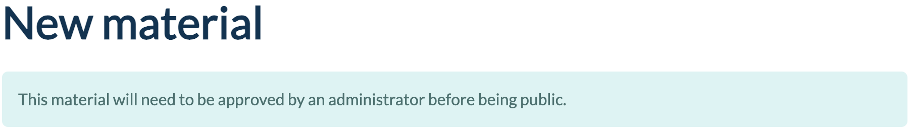
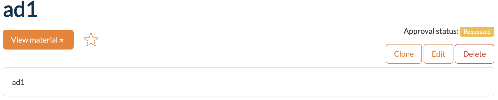
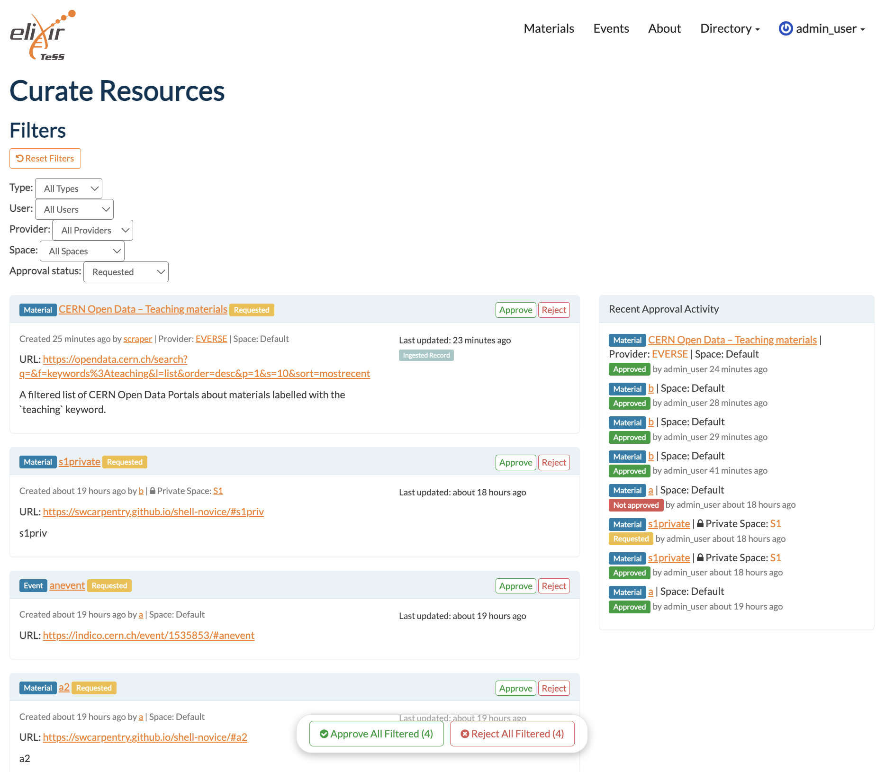

# Content Curation

## Prerequisites

Ask your TeSS administrator if the `material_under_admin_approval` or `event_under_admin_approval` features are enabled.

To see if your TeSS instance is supporting this feature, if you [manually register](./manual.md) a training material or event, the message *"This material/event will need to be approved by an administrator before being public"* is shown on the top of the form like the following screenshot:

## How training resources are curated in TeSS?

When [prerequisites](#prerequisites) are met, any added training material or event (either [manually](./manual.md) or [automatically](./auto.md)) will be **by default** subject to verification and thus, not publicly shown in your TeSS instance. Your resource will be marked with an `Approval status` set to `Requested`, as shown below:

Once a resource is registered or ingested, the curation/verification can be made by `administrators`,`curators` or `space administrators`, which are specific TeSS user roles (generally speaking, *curators*). Space administrators can only see resources from their space.

*Curators* can then have access to a dashboard to review the newly registered resources by accessing the `your-tess-instance-website.org/curate/resources` page, which can be also found by clicking on the dropdown menu of the user profile on the top-right of the page once logged in > "Curate resources".

In the dashboard, *curators* can filter resources by Type (material, event), User, [Provider](../accounts/provider.md), [Space](../spaces/intro-spaces.md), and Approval Status. `Approve All Filtered` and `Reject All Filtered` buttons can be found at the bottom of the page to allow approval or rejection of the filtered resources. For example, if you have a new Content Provider adding thousands of already curated materials, you can filter the list by their name and approve them all in a few clicks only.

## How to revoke the approval status of a resource?

A *curator* may have misclicked the `Approve` button, they may come back to their decision by editing the resource manually, scroll down, and change the `Approval status` field to `Requested`.

---

## Developer source

See pull request [#1382](https://github.com/ElixirTeSS/TeSS/pull/1382).
