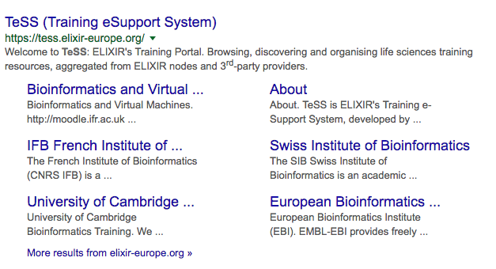
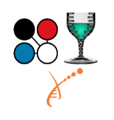

# Introduction to content registration

Training resources (events and materials) may be added to TeSS to reach bigger audiences, increase impact and bolster event attendance. Registering events and training materials makes them more findable in a variety ways to various user bases.

::::{grid} 1 1 2 3
:class-container: text-center
:gutter: 3

:::{grid-item-card}
... in TeSS
^^^

+++
Be seen by thousands of visitors to our site
:::

:::{grid-item-card}
... in search engines
^^^

+++
Be seen in search results more owing to our search-engine optimisation
:::

:::{grid-item-card}
... embedded in other sites
^^^

+++
Be seen across all the websites that display site resources through our [widgets](../developers/code-data).
:::

::::

There are two ways to register training materials or events for display in TeSS:

1. Arrange for an [automatic registration](auto) solution;
2. Use our form to register them [manually](manual).