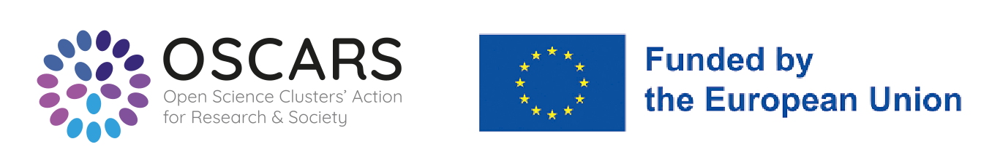

# mTeSS-X

## Scaling training portal federation for RIs through Multi-tenanting and Exchange

::::{grid} 1 1 2 2 
:class-container: sd-border-0 sd-align-major-justify
:gutter: 0

:::{grid-item}
:columns: 8
To overcome fragmentation of training resources across Research Infrastructures (RIs)
and the Science Clusters, the mTeSS-X project aims to enhance the existing
[ELIXIR TeSS platform](https://tess.elixir-europe.org/about) &mdash;
to build an aggregator for training portals like ELIXIR TeSS and
[PaNOSC training portals](https://www.panosc.eu/training-catalogue/)
&mdash; to natively support federation.
:::

:::{grid-item}
:columns: 4
```{image} /images/overview/ri-350x160-secondary-white.svg
:class: only-dark
```
```{image} /images/overview/ri-350x160-secondary.svg
:class: only-light
```
:::
::::

Such a fully-featured open-source multi-tenanted training platform is expected to be an 
innovation for building a federation of portals to:

- help break down barriers between thematic communities,
- promote a more cohesive European research community,
- and promote FAIR and open training.

The project strives to support the federation of training catalogues using a multi-tenancy approach, and enabling cross-instance content exchange. This will allow RIs and their communities to maintain tailored catalogues with distinct identities, while simultaneously benefiting from a shared global pool of resources.


::::{grid} 1 2 2 3
:gutter: 3

:::{grid-item-card}
**Challenge**
^^^
Fragmentation of resources hampers the reuse of valuable training materials and limits the dissemination of events and learning pathways.
The main challenges of the project are i) to enable the federation of catalogues, ii) support cross-discipline training resource exchange, and iii) celebrate and maintain catalogue unique identity.
:::

:::{grid-item-card}
**Solution**
^^^
mTeSS-X will extend the TeSS platform by introducing multi-tenancy, allowing multiple communities to maintain distinct training catalogues within a shared instance, while preserving their individual identities.
It will also implement TeSS-X plugins to facilitate seamless content exchange between catalogues implemented as separate instances.
:::

:::{grid-item-card}
**Scientific impact**
^^^
By fostering the federation of interoperable training catalogues, mTeSS-X will significantly enhance the findability, accessibility, and reuse of high-quality training resources ([FAIR principles](https://www.go-fair.org/fair-principles/)).
:::
::::


```{button-link} https://elixirtess.github.io/mTeSS-X/
:color: primary
View the mTeSS-X project website
```


### Partners


::::{grid} 2 3 5 5 
:class-container: text-center sd-border-0 sd-align-major-justify
:gutter: 3

:::{grid-item}
:class: justify-content-center
[](http://www.manchester.ac.uk/)
:::

:::{grid-item}
:class: justify-content-center
[](https://www.hzdr.de/db/Cms?pOid=44909&pNid=0&pLang=en)
:::

:::{grid-item}
:class: justify-content-center
[](https://www.ul.ie/)
:::

:::{grid-item}
:class: justify-content-center
[](https://ut.ee/en)
:::

:::{grid-item}
:class: justify-content-center
[](https://home.cern/)
:::
::::


### Supporters

[ALBA Synchrotron](https://www.cells.es/en), [Bioconductor](https://bioconductor.org/), [BioFAIR](https://biofair.uk/), [ELIXIR Belgium](https://www.elixir-belgium.org/), [ELIXIR Europe](https://elixir-europe.org/), [Ersilia](https://www.ersilia.io/), [European Synchrotron Radiation Facility (ESRF)](https://esrf.fr/), [Helmholtz Metadata Collaboration (HMC) Hub Matter](https://helmholtz-metadaten.de/en), [OLS](https://we-are-ols.org/)


### Project team members
Carole Goble (Principle Investigator, The University of Manchester), Oliver Knodel (Helmholtz-Zentrum Dresden-Rossendorf), Finn Bacall (The University of Manchester), Phil Reed (The University of Manchester), Munazah Andrabi (The University of Manchester), Kenneth Rioja (CERN), Maria Doyle (University of Limerick), Hedi Peterson (TARTU ULIKOOL)


<br><br>

::::{grid} 1 1 1 1
:class-container: sd-border-0 sd-align-major-justify
:gutter: 3

:::{grid-item-card}
**OSCARS: Open Science Clusters' Action for Research & Society**
^^^

[](https://oscars-project.eu/)

[OSCARS](https://oscars-project.eu/) is a four-year EU-funded project that strives to foster
the uptake of Open Science in Europe by consolidating the
achievements of world-class European research
infrastructures in the ESFRI roadmap and beyond into lasting
interdisciplinary FAIR data services and working practices.
The project aims to strengthen the role of the Science
Clusters in the ERA by developing domain-based
Competence Centres and by fostering the implementation of
Open Science projects funded through a cascading grant
mechanism.

:::
::::
