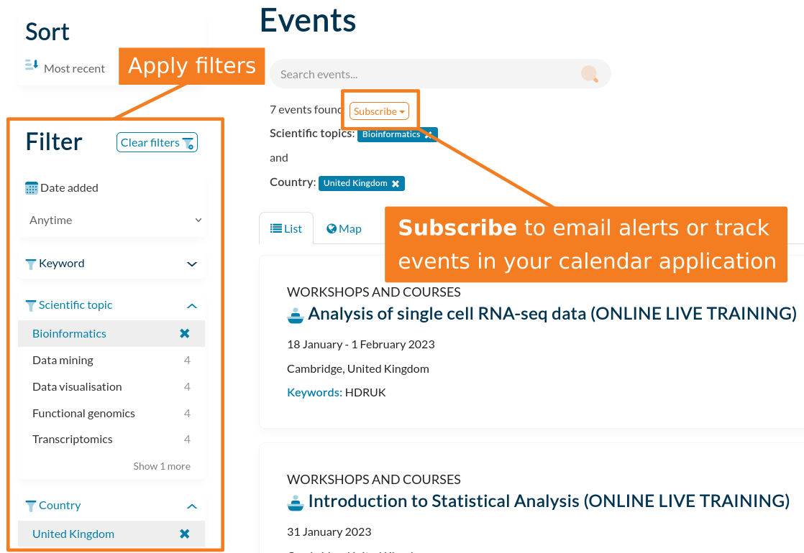

# Subscribing to notifications

TeSS also provides a subscription feature to help users to stay informed about courses, workshops and conferences of interest to them. 
The service may be customised by selecting the relevant filters, and initiated via the subscribe button. 
Users may choose to receive email notifications about upcoming events, or have them automatically added to their preferred calendar application.

## Adding scriptions

To add a scription:

1. Apply a choice of filters to show the type of events you are interested in.
2. Click the 'Subscribe' button near the top of the results to email alerts or track events in your calendar application.

::::{grid} 1 1 2 2
:class-container: sd-border-0

:::{grid-item}
:columns: 10

:::
::::

## Managing subscriptions

The subscriptions manager page may be used to change the frequency of, or to remove, subscriptions.

To find the subscriptions manager page:

1. If you have not yet logged in, in the top menu, click 'Log In'.
2. In the top menu, click your username, then click 'My profile'.
3. At the top-right, click the 'Manage subscriptions' button.