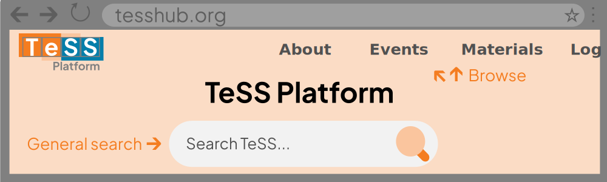

# Searching for training resources

## Getting started searching in TeSS

Training resources (both events and materials) may be searched in TeSS in several ways.

::::{grid} 1 2 2 2
:gutter: 3

:::{grid-item-card}
{fas}`magnifying-glass;sd-text-secondary` **General search**
^^^
If you are on the main page of TeSS, a general search can be performed based on keywords, which will return separate lists of events and materials.
:::
:::{grid-item-card}
{fas}`filter;sd-text-secondary` **Browsing and filtered search**
^^^
Use the tabs at the top of the page to browse events or materials separately then perform a more advanced search. 
:::
::::



Browsing by events or materials allows more precise filtering on several parameters (such as event type, country, and target audience), alone or in combination. You can also search for content providers, users and other types of training.


## General search

To perform a general search:

1. In the top menu, click 'Home'.
2. Click in the big search box in the centre of the screen and enter your query.
3. Click the magnifying lens (search) button to the right or press {kbd}`Enter`.
4. The search results are displayed in tabs for each type of result. These may include events, materials, content providers, learning paths, workflows, users, collections (depending on the search).

## Browsing and filtered search

To perform a filtered search on a particular type of training:

1. In the top menu, click the type of training you wish to search.
2. You can enter **keywords** in the search box above the results.
3. You can **sort** results by date or title using the control on the left.
4. You can **filter** results by multiple paramaters using the controls on the left.
  - For example, search across all spaces in a TeSS instance by clicking 'Show materials from all spaces'.
5. You can move through the pages of results at the bottom of the page.

Descriptions of the filters can be found on the [Definitions](../overview/definitions) page.

```{admonition} See also guidance from the ELIXIR Training Platform
:class: seealso
* [Searching in TeSS](https://elixir-europe-training.github.io/ELIXIR-TrP-TeSS/chapters/chapter_01/)
```
