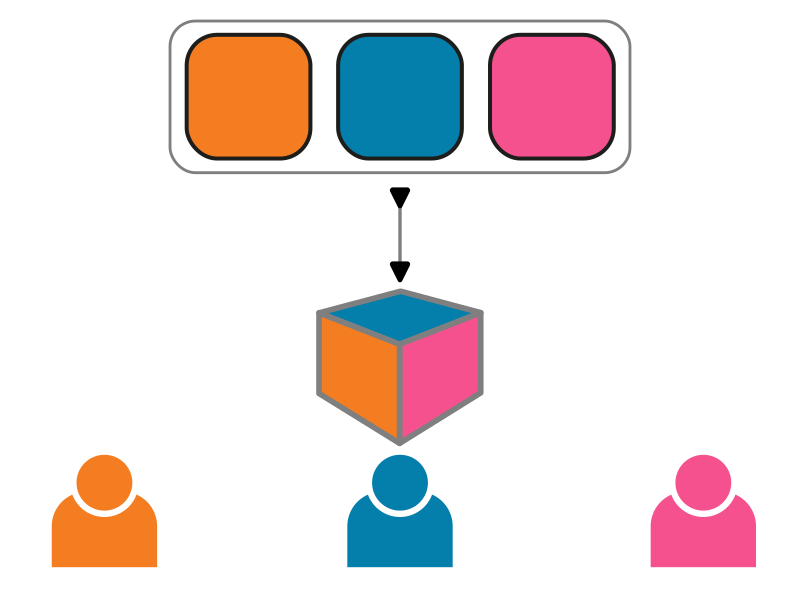

# Introduction to spaces

A single TeSS instance can present multiple tailored catalogues whose selections of training material are “views” on a global catalogue. 
Each community registers, maintains and curates their material for their members in their own virtual space in the common portal environment.

This new feature is possible thanks to the [mTeSS-X project](../overview/mtess-x). Catalogues are pooled into a shared instance but look to their community as if they have their own catalogue with their own identity.

