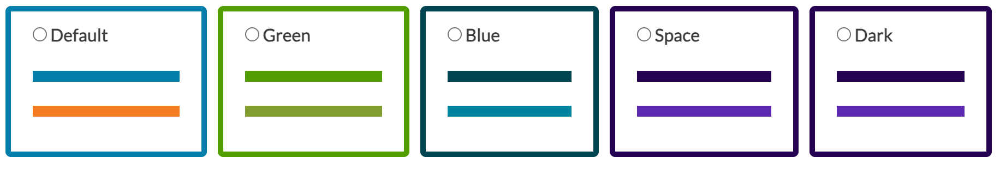

# Request a new space

Spaces are customisable, community-managed sub-portals within TeSS, each with their own catalogue of training content. 
New spaces can be requested by communities who wish to present their own catalogue with their own identity, for example, the Research Data Management community in ELIXIR. 
The request will be processed by an administration team. 
If the request is approved, the administration team will create the space for you. 
Further details about the governance of spaces are decided by the administration team of each TeSS instance.

```{admonition} The following TeSS instances support mutiple spaces:
:class: note
* ELIXIR TeSS (coming soon; until then, see [ELIXIR TeSS sandbox](https://dev.tess.elixir-europe.org/spaces))
* PaN Training (coming soon)
* Other instances to be announced
```


Steps to request a space:

1. Select a TeSS instance with multiple spaces for your request.
2. Prepare the following details of the new space: Title, Description, Image (logo for your community), Administrators (list of TeSS usernames to be space managers).
3. Select a theme (see below): Default, Green, Blue, Space, Dark.
4. Send these details to the administrator of the TeSS instance.
5. You will be informed of the outcome shortly.


There are currently five themes to choose from to style your new space.